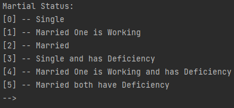
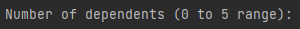
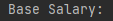
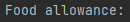
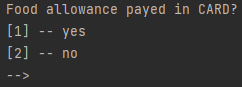
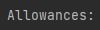
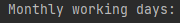
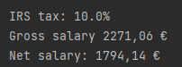

# Calculate Net salary

## About

The following repo contains a Java console application that returns IRS precise information about salary.

After gathering the user's info, the app will search for the correct table and will then return the correct data.

With the help of Apache POI XSSF, XSSFWorkbook will always return data from the correct row and column.

## It shows how to:
* set system main directory with System.getProperty()
* work with XSSFWorkbook to identity a .xlsx file
* work XSSFSheet to identify the wanted sheet name/index
  * to get the total rows count, in order to use as a limit on loops
  * with both XSSFWorkbookset and XSSFSheet set, any exact data can be found with the right loops/mapping
* always validate every user input
* XSSFSheet logic around rows and columns fixtures
* work with List values
* cycle data without the need of nested loops
* work with System.out.format and print currency values properly

## How it works:
* after running the app, the user will be prompted with:

### output example:

